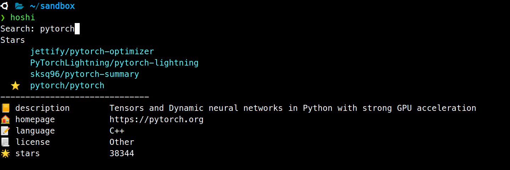

<p align="center">
  <a href="https://github.com/skmatz/hoshi">
    
  </a>
</p>

<p align="center">
  <a href="https://github.com/skmatz/hoshi/actions?query=workflow%3Abuild">
    
  </a>
  <a href="https://github.com/skmatz/hoshi/actions?query=workflow%3Arelease">
    
  </a>
  <a href="./LICENSE">
    
  </a>
  <a href="./go.mod">
    
  </a>
  <a href="https://github.com/skmatz/hoshi/releases/latest">
    
  </a>
</p>

<p align="center">
  
</p>

# Hoshi

:sparkles: A CLI to open GitHub favorite repositories in browser

## Install

### Binary

Get binary from [releases](https://github.com/skmatz/hoshi/releases).

### Source

```sh
go get github.com/skmatz/hoshi
```

## Settings

Before using `hoshi`, add the following to your `~/.gitconfig`.

```ini
[github]
user = <GitHub User ID>
```
